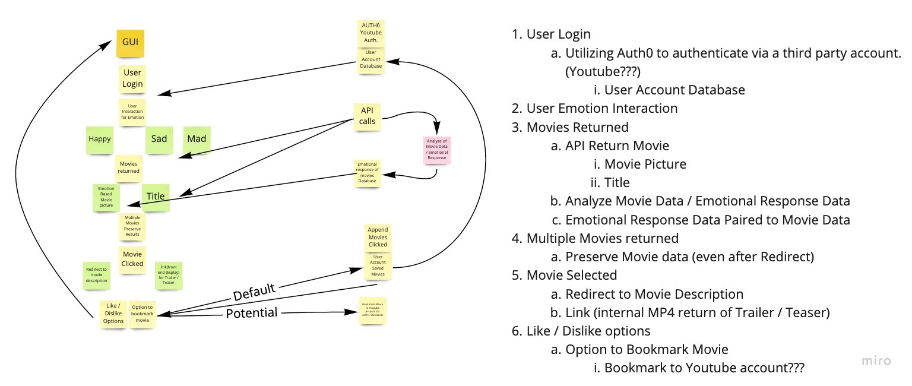

# DreamTeamAlphaOne

## [Team Agreement](prep/TeamAgreement.md)

## [Software Requirements](prep/requirements.md)

## [Link To Trello Board With User Stories](https://trello.com/b/pq4HjcrR/disneyteamalphaone)

## Wireframes

## Domain Model

## Database Schema

# DreamTeamAlphaOne

Group Project: Team Agreement

Cooperation Plan
Every person on your team is an asset. This is your chance to discover the hidden strengths and areas for growth for each team member.

Describe at least:
## What are the key strengths of each person on the team?
- Michael H. 
  - Analytical Thinking
  - Problem Solving

- Michael R.
  - Team work / Colaboration

- Kassie Bradshaw
  - Human linter
  - Organization
  - Flexibility

- Anthony Williams
  - None
  - Organization 
  - Flexibility

## How can you best utilize these strengths in the execution of your project?
- Be flexible and organized, Working colab... as a team, with analytical thinking and problem solving.

## In which professional competencies do you each want to develop greater strength?
- Michael H. 
  - Handling ambuigiuiity 
  - Organization

- Michael R.
  - Digitial Technology -- Python. Manage.py 

- Kassie Bradshaw
  - Working more effectively in a team

- Anthony Williams
  - Not overthinking smaller "more simple" issues at hand

## Knowing that every person in your team needs to understand all aspects of the project, how do you plan to approach the day-to-day work?
  - Ensure each team member is in full understanding of the topic / task at hand. Ensure each other that if confusion arises, they will speak up with questions.

# Conflict Plan
Your team should agree on a process for handling disagreements, should they arise. It is better to have a plan in place ahead of time so you can all refer back to it when necessary.
Describe at least:

## What will be your group’s process to resolve conflict, when it arises?
  - Ro sham bo?
  - majority rules, If split decision.... See #1

## What will your team do if one person is taking over the project and not letting the other members contribute?
  - Address the issue

## How will you approach each other and the challenges of the project knowing that it is impossible for all members to be at the exact same place in understanding and skill level?
  - Be understanding of each others strengths and weekness'
  - Let Each Other pick the tasks they are interested / want to tackle

## How will you raise concerns to members who are not adequately contributing?
  - Address it, we're all adults.

## How and when will you escalate the conflict if your resolution attempts are unsuccessful?
 - We're all adults
 - 4 way ro sham bo

# Communication Plan
Before beginning to tackle the project, determine how your group will communicate with each other. This is not an individual effort. Make sure everyone feels comfortable with the identified methods of speaking up.
Describe at least:

## What hours will you be available to communicate?
- School Hours
- Anytime Communication  no workie until schoolie

## What platforms will you use to communicate
  - Skaackm, Remo, Zoom, Carrier Pigeons 

## How often will you take breaks?
-  NEVER
- We're adults

## What is your plan if you start to fall behind?
- work harder
- panic @ the disco
- Lower Standards 

## How will you communicate after hours and on the weekend?
- We wouldnt? but....
- Slack is the primary method of communication

## What is your strategy for ensuring everyone’s voice is heard?
- listen?
- DSU

## How will you ensure that you are creating a safe environment where everyone feels comfortable speaking up?
- Practice psychological safety?
- we're adults

# Work Plan
Explain your work plan to track whether everyone is contributing equally to all parts of the project, and that each person is working on “meaty” problems. This should prevent “lone wolf” and “siloed” efforts.
Describe at least:

## How will you identify tasks, assign tasks, know when they are complete, and manage work in general?
- Courtesy of me, Trello... If everybody is okay with that. 

# Plan out what your team’s Git workflow looks like for coding tasks.
Describe at least:

## What components of your project will live on GitHub?
- All / Repo

## How will you share the repository with your teammates?
- ORG 

## What is your Git flow?
- Main Branch (PRODUCTION)
-- Dev Branch (NON-PRODUCTION)
-- Merge to DEV -> Main with BIG Accomplishments (IE: Milestones)
--- Merge Request / Conflict Plan at DSU(Start of class)
---- ACP at the end of EVERY school day. 

# Will you be using a PR review workflow? If so, consider:
Yes 

## How many people must review a PR?
2 People to review 

## Who merges PRs? 
One of the reviewers 

## how often will you merge? 
-- Merge request beginning of school day -> Dev
-- Dev -> Main (big accomplishments)

## How will you communicate that it’s time to merge? 
DSU -- Slack -- Remo

